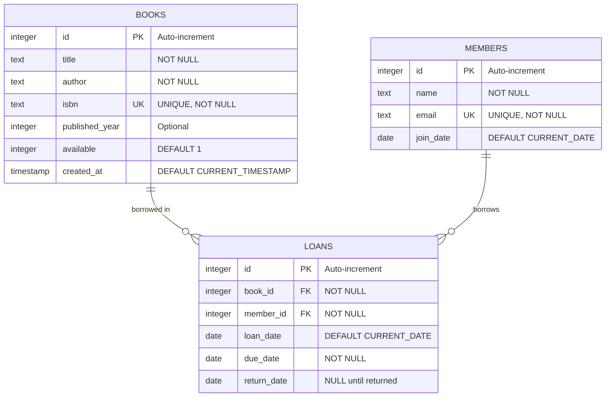
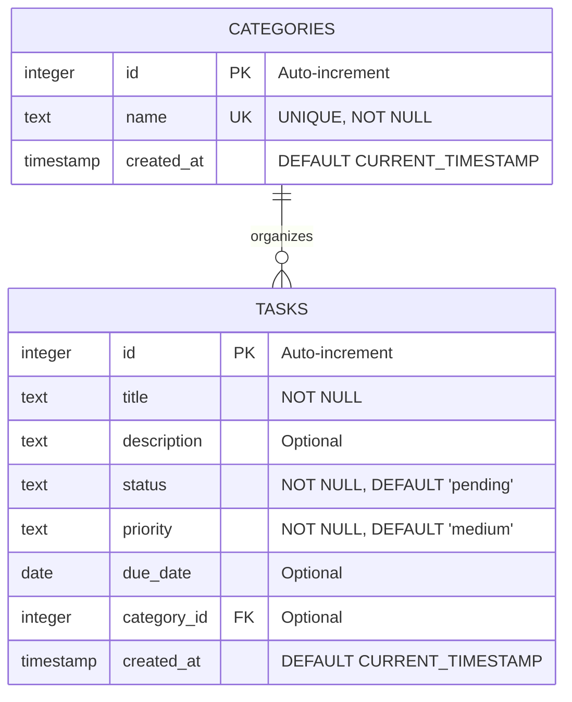
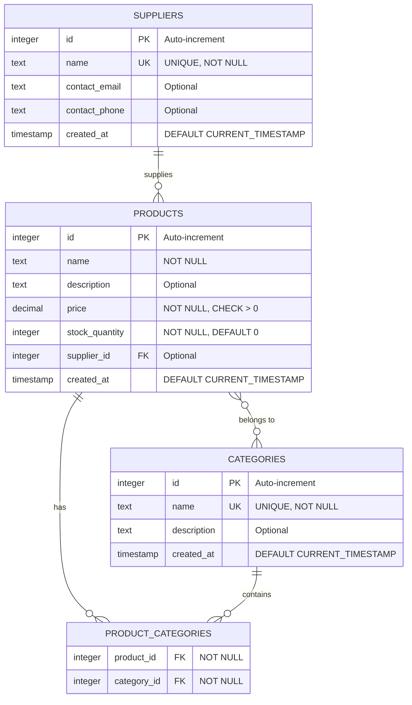

# Database Schema Diagrams

Visual representations of the database schemas used in this project.

## Table of Contents
- [Library System Schema](#library-system-schema)
- [Todo System Schema](#todo-system-schema)
- [Inventory System Schema](#inventory-system-schema)

---

## Library System Schema

**Reference Implementation** - Study this complete schema to understand database design patterns.

### Entity Relationship Diagram



### Relationships

- **One-to-Many**: One book can have many loans (over time)
- **One-to-Many**: One member can have many loans
- **Foreign Keys**: 
  - `loans.book_id` → `books.id`
  - `loans.member_id` → `members.id`

### Key Concepts Demonstrated

1. **Primary Keys**: Each table has an auto-incrementing `id`
2. **Unique Constraints**: ISBN and email must be unique
3. **Foreign Keys**: Loans reference both books and members
4. **Default Values**: New books are available by default
5. **NULL Handling**: `return_date` is NULL until book is returned
6. **Timestamps**: Track when records are created

### Example Queries

```sql
-- Get all books currently on loan
SELECT b.title, m.name, l.due_date
FROM loans l
JOIN books b ON l.book_id = b.id
JOIN members m ON l.member_id = m.id
WHERE l.return_date IS NULL;

-- Find overdue books
SELECT b.title, m.name, l.due_date
FROM loans l
JOIN books b ON l.book_id = b.id
JOIN members m ON l.member_id = m.id
WHERE l.return_date IS NULL 
  AND l.due_date < CURRENT_DATE;
```

---

## Todo System Schema

**Guided Exercise** - Complete the TODOs to build this schema.

### Entity Relationship Diagram



### Relationships

- **One-to-Many**: One category can have many tasks
- **Optional Relationship**: Tasks can exist without a category
- **Foreign Key**: `tasks.category_id` → `categories.id`

### Field Details

**Status Values** (enforced in application code):
- `pending` - Task hasn't been started
- `in_progress` - Task is being worked on
- `completed` - Task is finished

**Priority Values** (enforced in application code):
- `low` - Can be done later
- `medium` - Normal priority
- `high` - Urgent, should be done soon

### Key Concepts Demonstrated

1. **Enum-like Fields**: Status and priority use TEXT with validation
2. **Optional Fields**: Description, due_date, and category_id can be NULL
3. **Default Values**: New tasks start as 'pending' with 'medium' priority
4. **Optional Foreign Keys**: Tasks don't require a category

### Example Queries

```sql
-- Get all pending tasks with high priority
SELECT title, due_date
FROM tasks
WHERE status = 'pending' 
  AND priority = 'high'
ORDER BY due_date;

-- Get tasks by category
SELECT c.name as category, t.title, t.status
FROM tasks t
LEFT JOIN categories c ON t.category_id = c.id
ORDER BY c.name, t.created_at;

-- Get overdue tasks
SELECT title, due_date, priority
FROM tasks
WHERE status != 'completed'
  AND due_date < CURRENT_DATE
ORDER BY priority DESC, due_date;
```

---

## Inventory System Schema

**Challenge Exercise** - Design and implement this schema yourself!

### Entity Relationship Diagram



### Relationships

- **One-to-Many**: One supplier can supply many products
- **Many-to-Many**: Products can belong to multiple categories
- **Junction Table**: `product_categories` links products and categories
- **Foreign Keys**:
  - `products.supplier_id` → `suppliers.id`
  - `product_categories.product_id` → `products.id`
  - `product_categories.category_id` → `categories.id`

### Key Concepts to Implement

1. **Many-to-Many Relationships**: Use junction table for products ↔ categories
2. **Business Logic**: Stock quantity cannot be negative
3. **Price Validation**: Price must be positive
4. **Optional Relationships**: Products can exist without a supplier
5. **Composite Keys**: Junction table uses combination of foreign keys

### Design Considerations

**Products Table**:
- Name and price are required
- Stock quantity defaults to 0
- Supplier is optional (for products without known supplier)
- Consider adding SKU (Stock Keeping Unit) field

**Suppliers Table**:
- Name must be unique
- Contact information is optional
- Consider adding address fields

**Categories Table**:
- Name must be unique
- Description helps explain category purpose
- Consider adding parent_category_id for hierarchical categories

**Product_Categories Junction Table**:
- Links products to categories
- Allows products to be in multiple categories
- Consider adding a composite primary key: `PRIMARY KEY (product_id, category_id)`

### Example Queries to Support

```sql
-- Get all products with low stock (< 10 units)
SELECT p.name, p.stock_quantity, s.name as supplier
FROM products p
LEFT JOIN suppliers s ON p.supplier_id = s.id
WHERE p.stock_quantity < 10
ORDER BY p.stock_quantity;

-- Get all products in a category
SELECT p.name, p.price, p.stock_quantity
FROM products p
JOIN product_categories pc ON p.id = pc.product_id
JOIN categories c ON pc.category_id = c.id
WHERE c.name = 'Electronics';

-- Get products by supplier with category info
SELECT p.name, s.name as supplier, 
       GROUP_CONCAT(c.name) as categories
FROM products p
LEFT JOIN suppliers s ON p.supplier_id = s.id
LEFT JOIN product_categories pc ON p.id = pc.product_id
LEFT JOIN categories c ON pc.category_id = c.id
GROUP BY p.id;
```

---

## Schema Comparison

| Feature | Library | Todo | Inventory |
|---------|---------|------|-----------|
| **Complexity** | Medium | Simple | Complex |
| **Tables** | 3 | 2 | 4 |
| **Relationships** | 1:Many | 1:Many | 1:Many + Many:Many |
| **Foreign Keys** | 2 | 1 | 3 |
| **Junction Tables** | 0 | 0 | 1 |
| **Status** | Complete | Guided | Challenge |

## Learning Path

1. **Study Library Schema** (`database/schemas/library_schema.sql`)
   - Understand table structure
   - Learn foreign key relationships
   - See how constraints work

2. **Complete Todo Schema** (`database/schemas/todo_schema.sql`)
   - Add missing fields following TODOs
   - Create categories table
   - Add foreign key constraint

3. **Design Inventory Schema** (`database/schemas/inventory_schema.sql`)
   - Design tables from scratch
   - Implement many-to-many relationship
   - Add appropriate constraints

## Viewing Your Schemas

### Using SQLite Command Line

```bash
# Open database
sqlite3 data/learning_project.db

# View all tables
.tables

# View table structure
.schema books
.schema tasks
.schema products

# Exit
.quit
```

### Using Python

```python
import sqlite3

conn = sqlite3.connect('data/learning_project.db')
cursor = conn.cursor()

# Get all tables
cursor.execute("SELECT name FROM sqlite_master WHERE type='table'")
print(cursor.fetchall())

# Get table info
cursor.execute("PRAGMA table_info(books)")
for row in cursor.fetchall():
    print(row)

conn.close()
```

## Additional Resources

- [SQLite Data Types](https://www.sqlite.org/datatype3.html)
- [SQLite Foreign Keys](https://www.sqlite.org/foreignkeys.html)
- [Database Normalization](https://en.wikipedia.org/wiki/Database_normalization)
- [ER Diagram Tutorial](https://www.lucidchart.com/pages/er-diagrams)

---

**Next Steps**: 
- Review the SQL schema files in `database/schemas/`
- Study the model implementations in `models/`
- Complete the TODOs in `models/todo.py`
- Design and implement the inventory system
